# __Auto Scaling Group with Load Balancer__

## Introduction
In this project, I implemented an Application Load Balancer (ALB) and configured Auto Scaling Groups (ASGs) — Static, Dynamic, and Scheduled — to efficiently manage traffic distribution and automatic scaling of EC2 instances.

This setup ensures high availability, fault tolerance, and scalability by distributing incoming requests across multiple EC2 instances and automatically adjusting capacity based on demand.

* I have created three Auto Scaling Groups:

🏠 Home (Static Scaling) – Maintains a fixed number of instances.

📱 Mobile (Scheduled Scaling) – Scales automatically based on a defined schedule.

💻 Laptop (Dynamic Scaling) – Scales in/out automatically based on CPU utilization.

Each Auto Scaling Group is connected to its respective Target Group, and all Target Groups are further connected to a single Application Load Balancer.
This allows smooth and efficient traffic routing across multiple applications hosted in different scaling environments.

* Architecture Diagram
  
 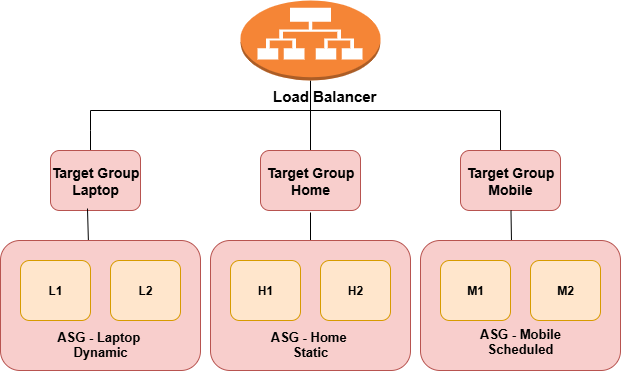

 ## Features
 * Integrated Application Load Balancer (ALB) with multiple Auto Scaling Groups (ASGs).

* Demonstrates Static, Dynamic, and Scheduled Scaling strategies.

* Ensures high availability and automatic traffic distribution across EC2 instances.

* Uses Launch Templates for consistent instance configuration.
  
## Project Flow
Step 1: Creating Launch Templates

Start by creating three Launch template - one each for Home, Mobile, and Laptop — each with different user data scripts.

1. Go to the Launch Templates section in the EC2 console and click Create Launch Template.

2. Give your template a name (e.g., Home-LT) and add a short description about its purpose.
   
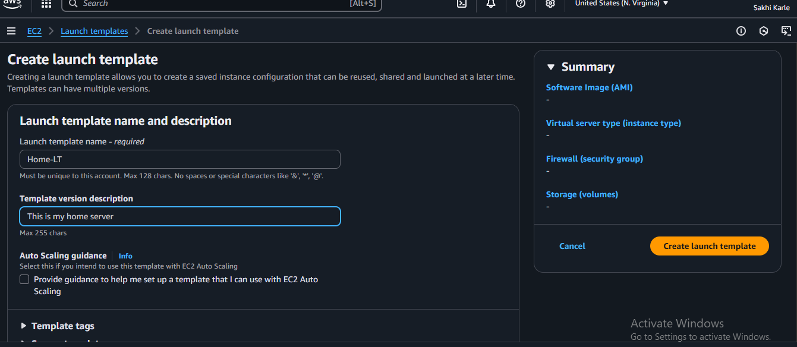

3. Under AMI, select one from Quick Start (I used Amazon Linux). You can also use your own custom AMI if you’ve created one.
   
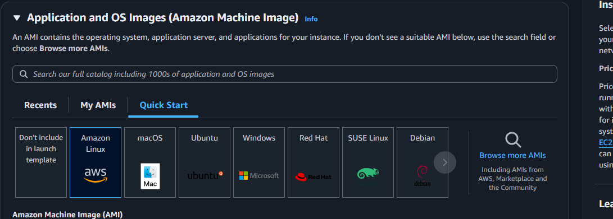

4. Choose your preferred instance type and key pair.
   

5. In Network Settings, open port 80 (HTTP) and port 22 (SSH). You can either use an existing Security Group or create a new one.

6. Scroll down to Advanced Details and add your user data script (this installs Apache and sets up your page).

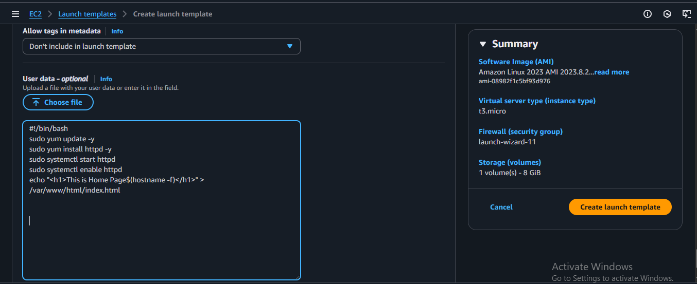

7. Click Create Launch Template once done.

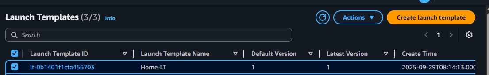

* Repeat the same process to create templates for Mobile and Laptop, but use their respective user data scripts below.
  
User datascript for mobile :

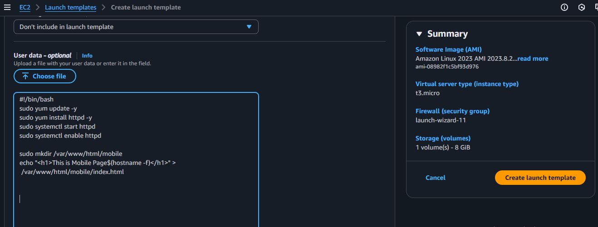

User datascript for Laptop :

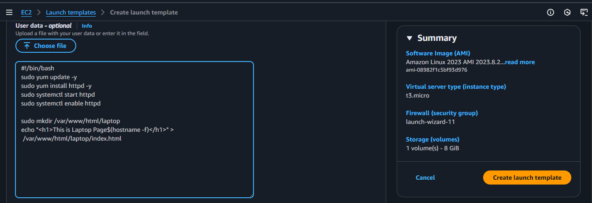

* Successfully created and lauched three EC2 template

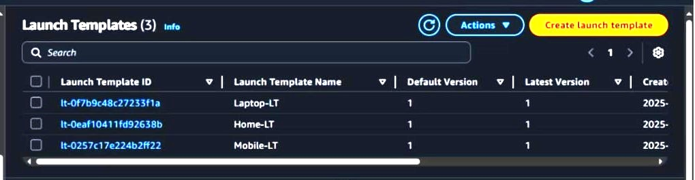

Step 2: Create Auto Scaling Groups(ASG) using these templates.

*  Go to Auto Scaling Groups section in the EC2 console and click create Auto Scaliing Group
  
1. Choose the Mobile Launch Template you created earlier and Enter name for your ASG (for ex: Mobile-ASG)

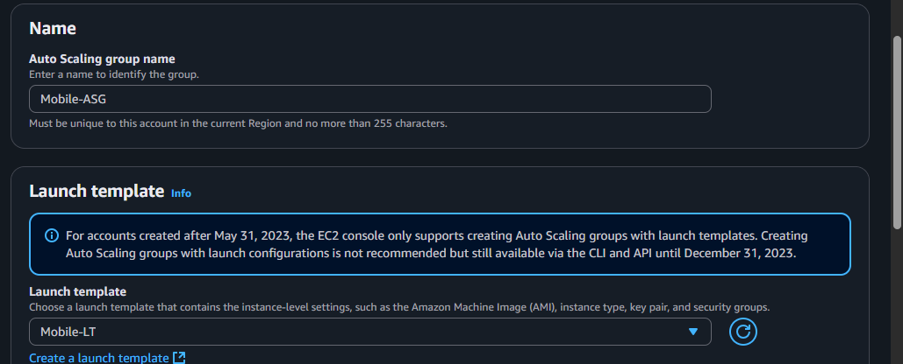
2. Select at least two Availability Zones for high availability.
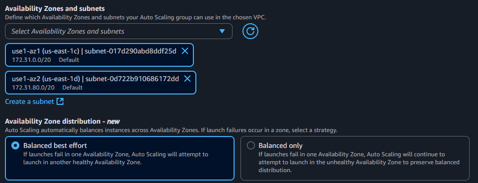
Click Next to continue.
3. Integrate with other services
   
   we are going to integrate these ASG with Load balancer after creating all 3 ASG. so for now let's go to next step..

4. Configure Group Size and Scaling
   
   * For Home (Static Scaling): Desired = 3, Min = 2, Max = 7
 
   * For Laptop (Dynamic Scaling): Desired =3, Min = 2, Max=7
  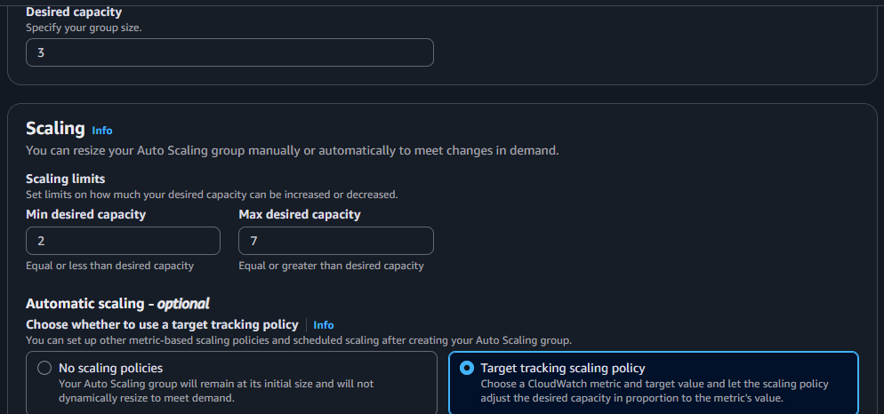
   * For Mobile (Scheduled Scaling): Desired = 3, Min = 2, Max=7
  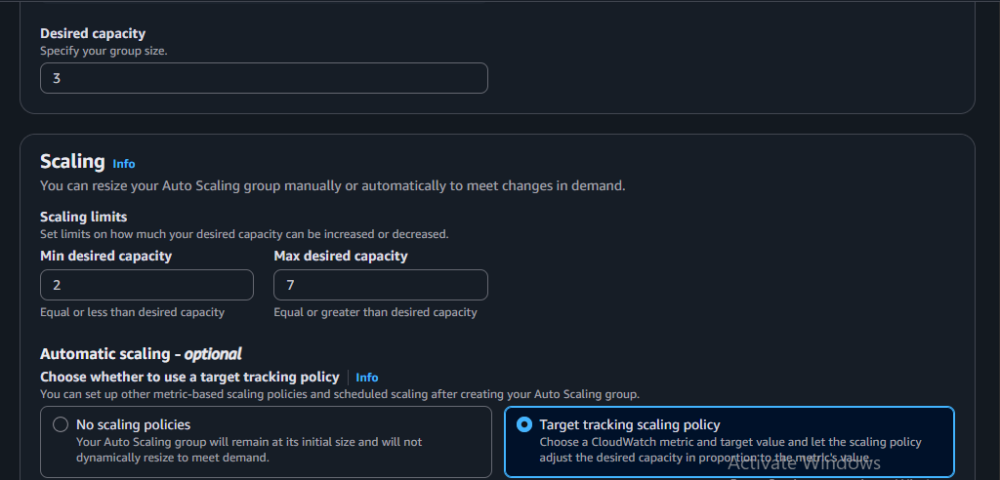
5. Set Target Tracking Scaling Policy (If your ASG is static you don't need to policy so select No Scaling Policy)
   * Select Metric type - CPU Utilization
   * Select Target value - 50%
   * Instance warm-up - 300 seconds (5 minutes)

   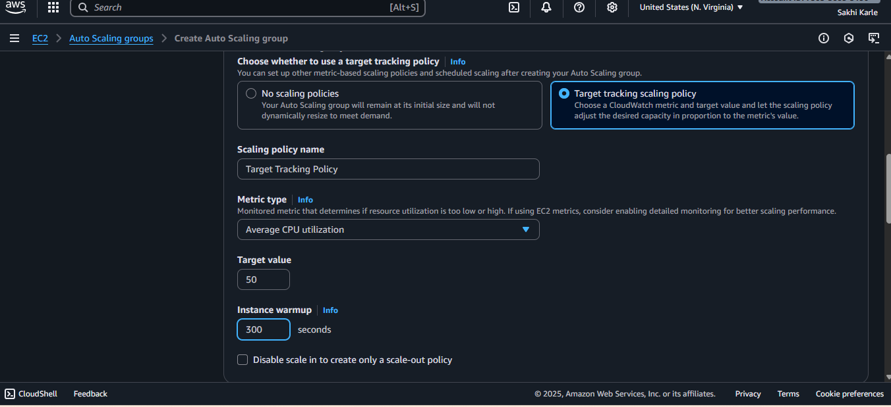
6. Notification and Tags 
   * You can skip these sections for now and click Next
  
   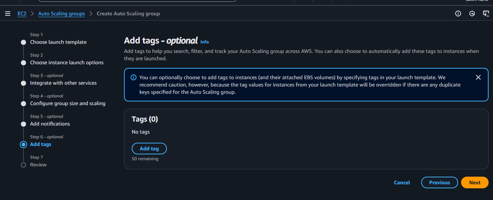
7. Review your configuration and create Auto Scaling Group.
   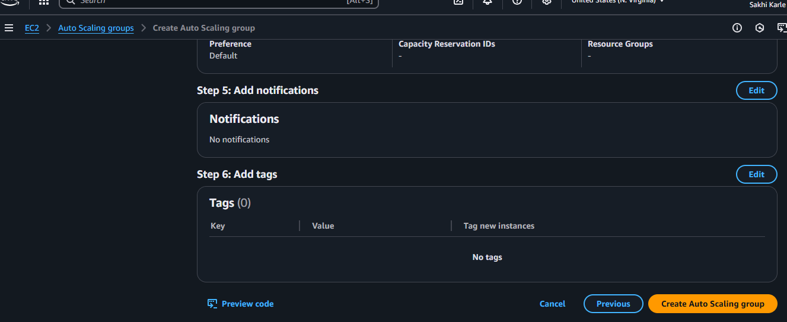

 Similarly create other 2 ASG according to their type static and dynamic. just need to change the group size as i mentioned.

   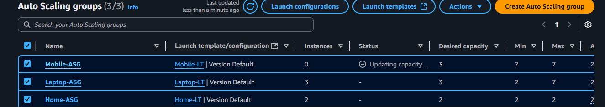

Configure Scheduled Scaling for Mobile ASG follow following steps:

1. Click on Mobile ASG from the list

2. Scroll down and click create scheduled action
3. Provide name for the schedule
4. Enter Desired, Minumum, and Maximum instance values
5. Under recurrence, choose the Cron expression option and specify the scheduled (Format: minute hour day month day-of-week)
   
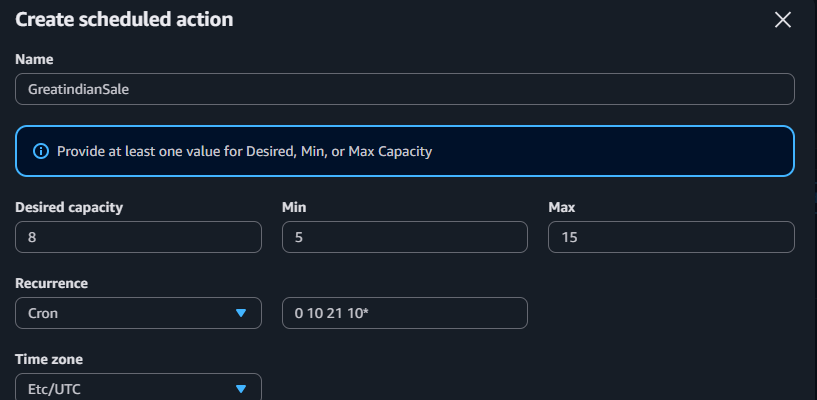

6. Enter the end time and click create

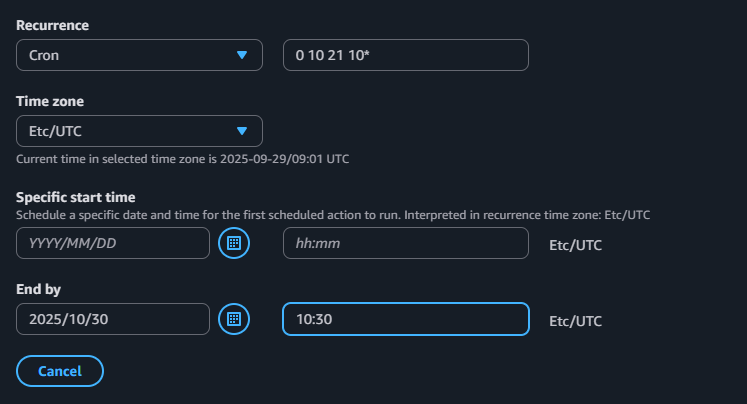

After creation, scroll down to scheduled actions in your Mobile-ASG to verify your scheduled task has been successfully added.

 Step 3: Creating Target Groups for Each Auto Scaling Group

1. Go to Target Groups section in the EC2 Console and click Create Target Group
2. Enter name for target group and keep HTTP on port 80 (default)

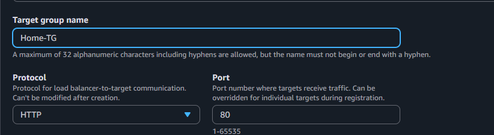

3. Scroll down and go to the health Check section then give a path of your application in Health Check path section.

[Note: i gave "/" as a path Here "/" represent the directory "/var/www/html/" which is default directory of httpd]

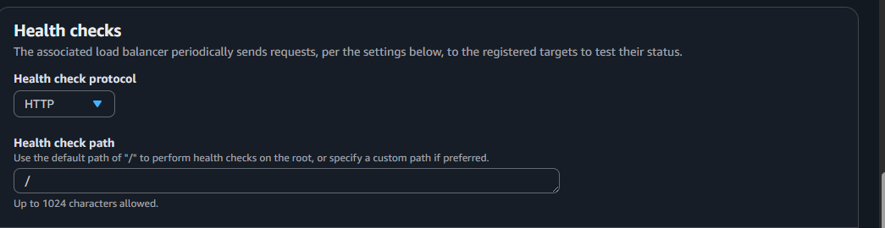
4. Click on Next, then Create Target Group  
- Follow the same steps to create Target Groups for Laptop and Mobile:
  
* For Mobile 
  
 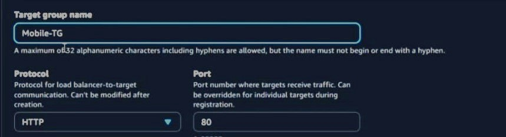

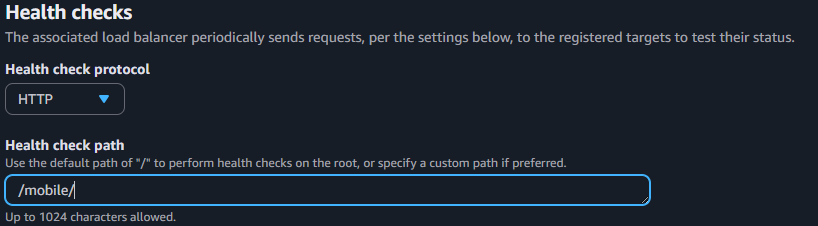
  
  *  For Laptop 
  
 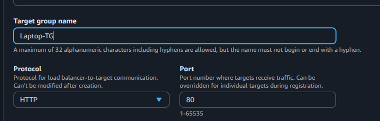

 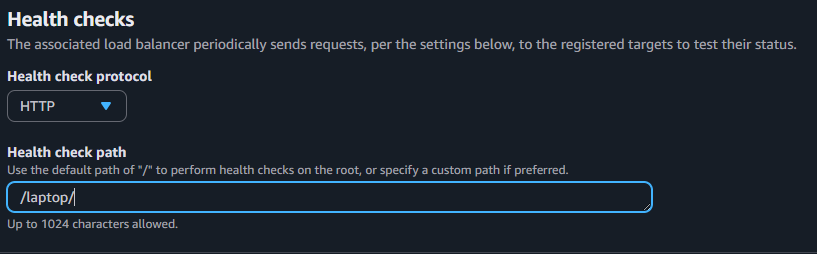

 Once done, you will see all three Target Groups listed in your EC2 dashboard.

Step 4: Connecting Auto Scaling group to Target Groups
   1. Select an Auto scaling Group
   * Click on Action at top right corner
   * Click on Edit
  
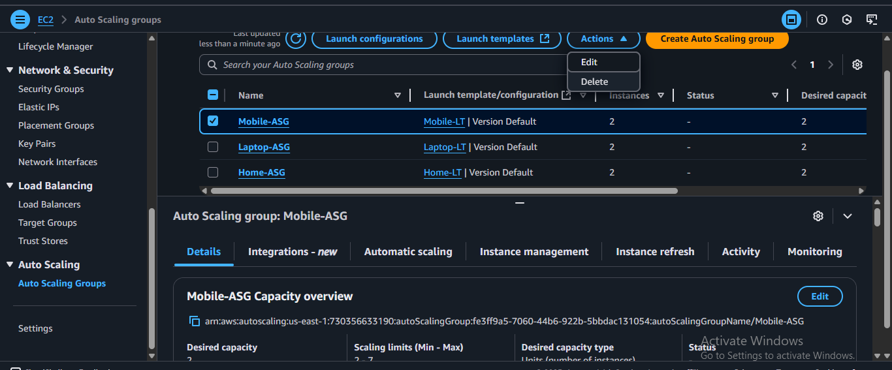 
2. Scroll down and you will see the Load balancing section
* Select a Target group for autoscaling group i selected (for laptop ASG select Laptop target group, mobile ASG select Mobile Target group)
  
For Home:
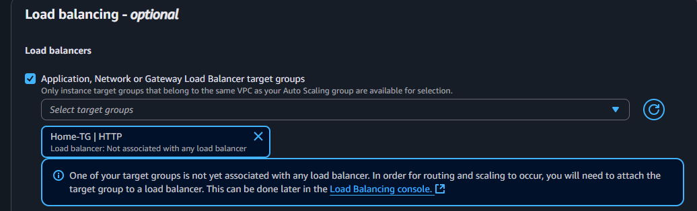
For Mobile:
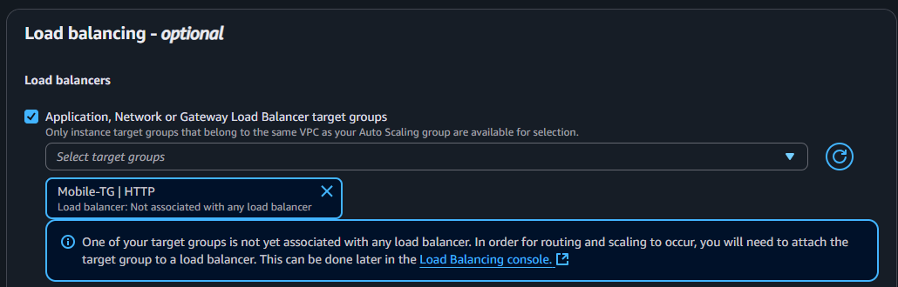  
For Laptop:

* Enter Countdown time and click on update
* Successfully connected the Autoscaling group and target groups
* Repeat process to coect each autoscaling group to its target group
* 
Step 5: Creating Application Load Balancer and Connencting to Target Groups
1. Go to Load Balancers and click on create load balancer
2. Select Application Load Balancer and click on create

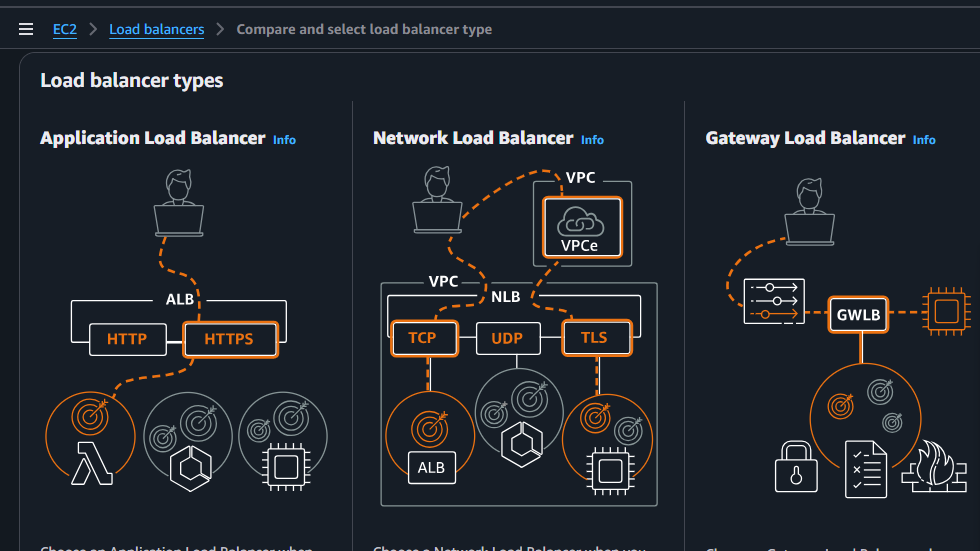
3. Give name to the Load Balancer
and select internet facing option

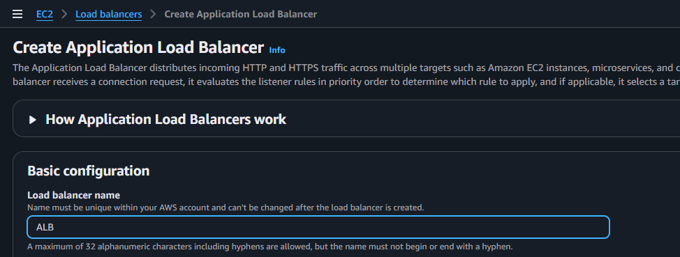
4. In Network Mapping section, Select Availability Zones atleast two. (choose AZ same as the AZ we selected while creating autoscalling group.)
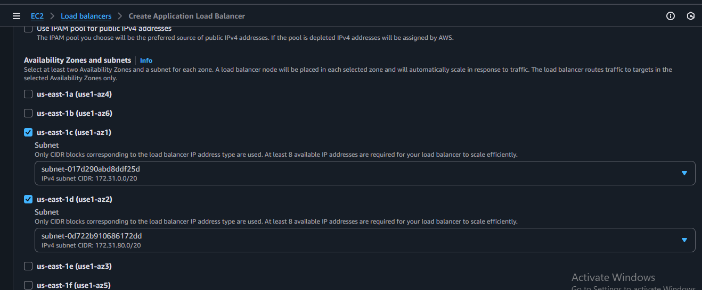
5. In Security Group section , select a existing security group.
(Select same security group we selected while creating autoscalling group)

6.In Listeners and Routing section select forward to target group Choose a default target group. (Here default target group is HomeTG) no need to change port n protocol. Click on Create Load Balancer

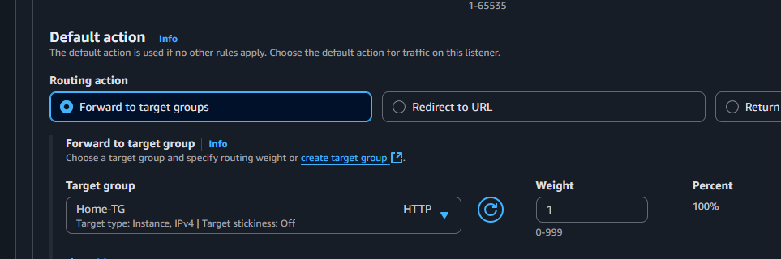
* Successfully Created Application Load Balancer

7. If you scroll down, you will see the HomeTG as defualt target group in Listners and Rules section.
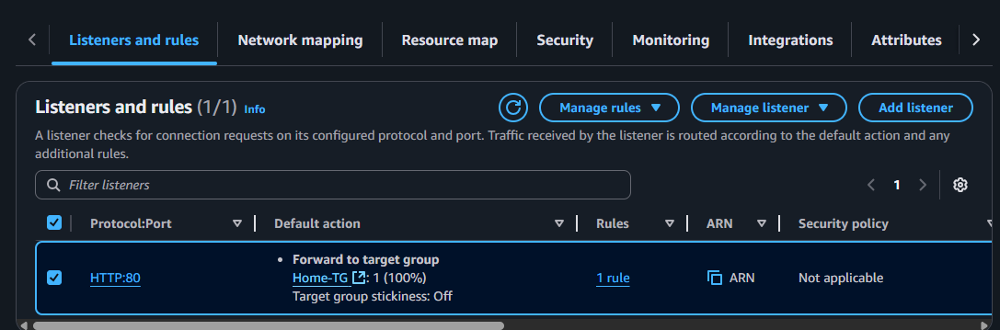
* To add other target group

    * Select HTTP80 i.e., Home TG
    * Click on Manage Rules
    *  Click on Add Rule

* Give name to rule.
   * In condition section , click on Add condition
   * Give path for mobile application   

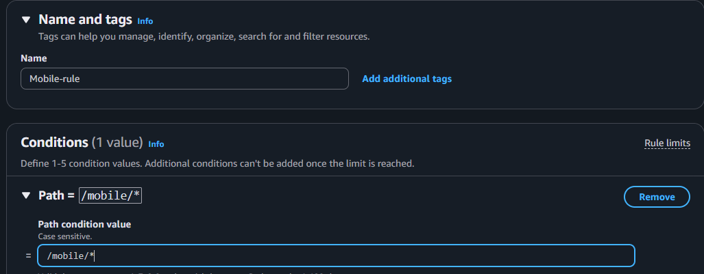
* In Actions section
   * select forward to target group
   * select the target group i.e., MobileTG
   * Go to next step..
* In Listners rule , give priority 1 for mobileTG
* click on next
* Click on Add rule
  
Successfully connected Mobile Target Group to Load balancer

* Similarly connect Laptop target group to load balancer with priority 2.
  
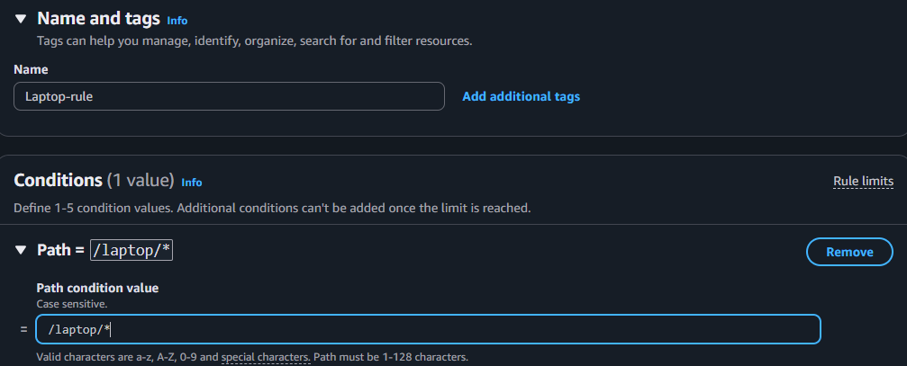

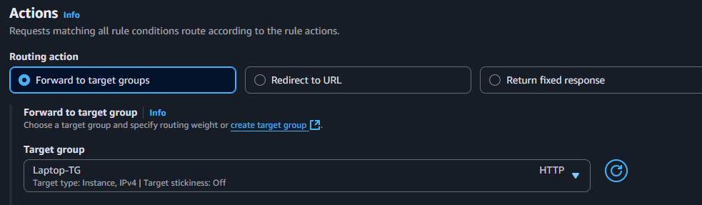

Now if you check in instance dashboard you will see the Active instances got created automatically.

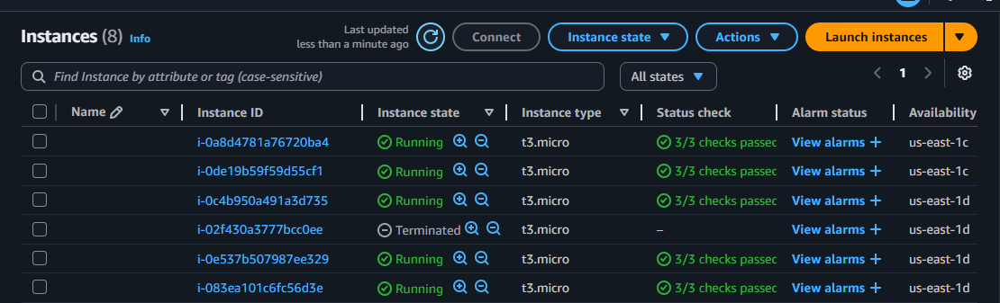

To check if it is working properly

* go to Load balacer.
* click on the load balancer we created
* scroll down and copy DNS name
* search it through browser
  
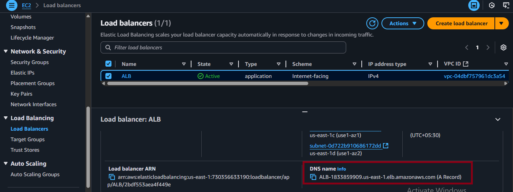

Step 5: Result

* The ALB DNS successfully routed traffic to all three target groups.

Scaling actions were verified:

*  Home ASG maintained fixed instances.
* Mobile ASG scaled according to schedule.
* Laptop ASG scaled dynamically on CPU utilization.
* Application remained available across multiple Availability Zones.
1. Output for Home Page
  
     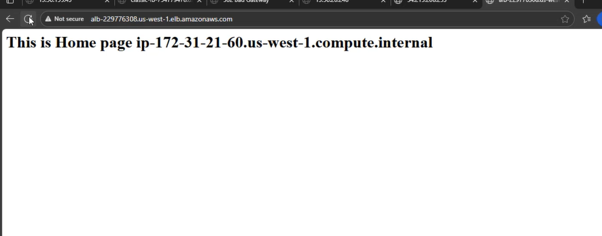  
     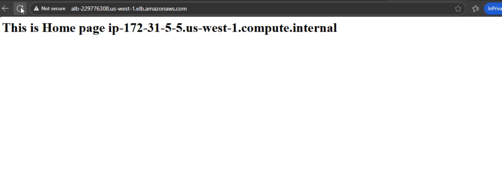

2. Output for Laptop Page
      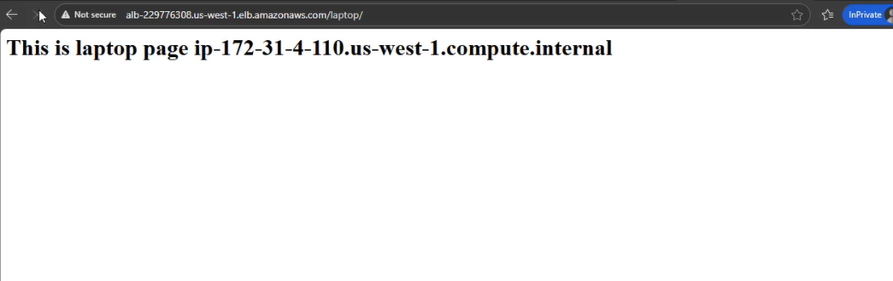  
      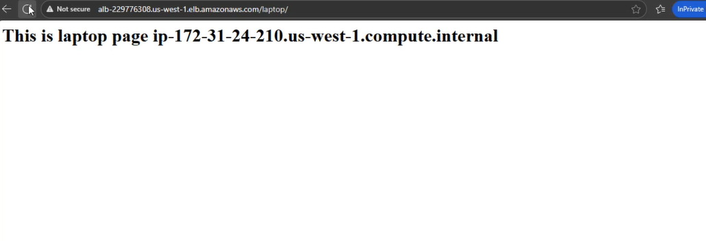

3. Output for Mobile page
   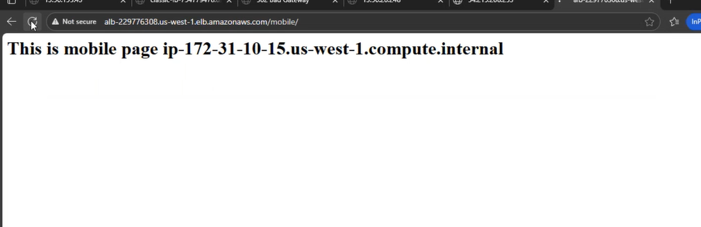  
   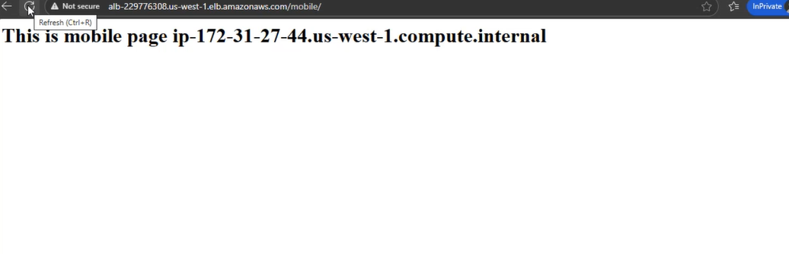

## Summary:
In this project, we successfully deployed a highly available, fault-tolerant, and scalable web application using AWS services. The Application Load Balancer (ALB) efficiently distributed incoming traffic across multiple EC2 instances, while the Auto Scaling Group (ASG) automatically maintained the optimal number of instances based on demand. This architecture ensures consistent performance, reduces downtime, and provides a reliable user experience even during traffic fluctuations.

   